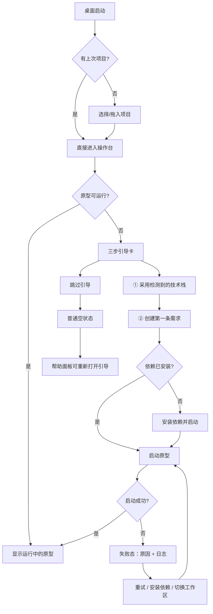

# 首次启动与新手引导 — 用户流程

## 核心用户旅程

```mermaid
flowchart TD
    A[桌面启动] --> B{有上次项目?}
    B -->|是| C[直接进入操作台]
    B -->|否| D[选择/拖入项目]
    D --> C
    C --> E{原型可运行?}
    E -->|是| F[显示运行中的原型]
    E -->|否| G[三步引导卡]
    G --> H[① 采用检测到的技术栈]
    H --> I[② 创建第一条需求]
    I --> J{依赖已安装?}
    J -->|否| K[安装依赖并启动]
    J -->|是| L[启动原型]
    K --> L
    L --> M{启动成功?}
    M -->|是| F
    M -->|否| N[失败态：原因 + 日志]
    N --> O[重试 / 安装依赖 / 切换工作区]
    O --> L
    G --> P[跳过引导]
    P --> Q[普通空状态]
    Q --> R[帮助面板可重新打开引导]
```

> 异常分支覆盖：缺依赖、没有 dev 脚本、启动超时、用户跳过、用户切换工作区。
