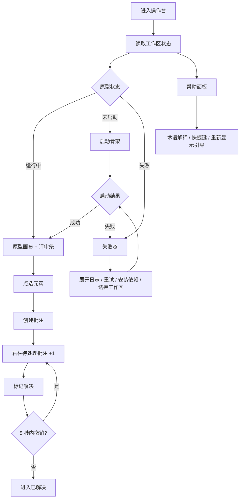

# 原型操作台主界面 — 用户流程

```mermaid
flowchart TD
    A[进入操作台] --> B[读取工作区状态]
    B --> C{原型状态}
    C -->|运行中| D[原型画布 + 评审条]
    C -->|未启动| E[启动骨架]
    C -->|失败| F[失败态]
    E --> G{启动结果}
    G -->|成功| D
    G -->|失败| F
    F --> H[展开日志 / 重试 / 安装依赖 / 切换工作区]
    H --> G
    D --> I[点选元素]
    I --> J[创建批注]
    J --> K[右栏待处理批注 +1]
    K --> L[标记解决]
    L --> M{5 秒内撤销?}
    M -->|是| K
    M -->|否| N[进入已解决]
    B --> O[帮助面板]
    O --> P[术语解释 / 快捷键 / 重新显示引导]
```
