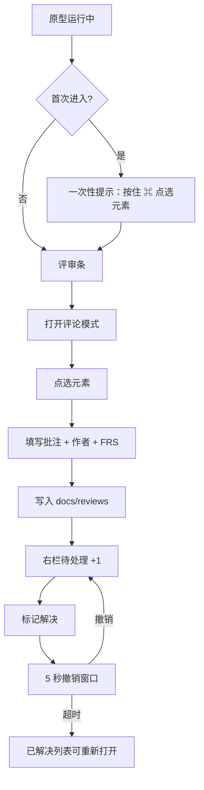

# 源码锚点评审 — 用户流程

```mermaid
flowchart TD
    A[原型运行中] --> B{首次进入?}
    B -->|是| C[一次性提示：按住 ⌘ 点选元素]
    B -->|否| D[评审条]
    C --> D
    D --> E[打开评论模式]
    E --> F[点选元素]
    F --> G[填写批注 + 作者 + FRS]
    G --> H[写入 docs/reviews]
    H --> I[右栏待处理 +1]
    I --> J[标记解决]
    J --> K[5 秒撤销窗口]
    K -->|撤销| I
    K -->|超时| L[已解决列表可重新打开]
```
