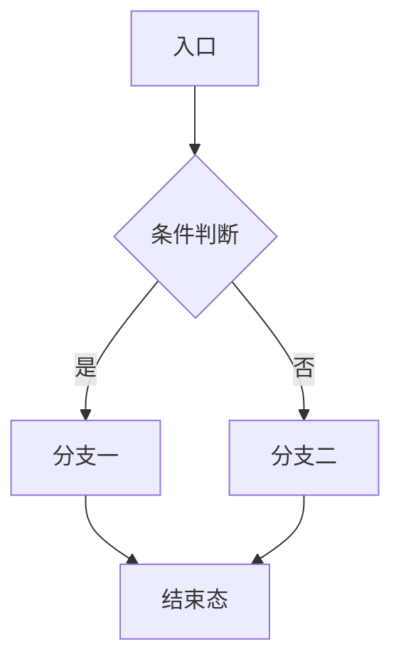

# <功能名称> — 用户流程

## 核心用户旅程

```mermaid
flowchart TD
    A[入口] --> B{条件判断}
    B -->|是| C[分支一]
    B -->|否| D[分支二]
    C --> E[结束态]
    D --> E
```

> 画完后自查：异常分支（无权限/空数据/超时/取消）是否都在图里，不能只画 happy path。
