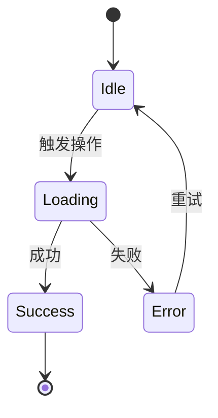
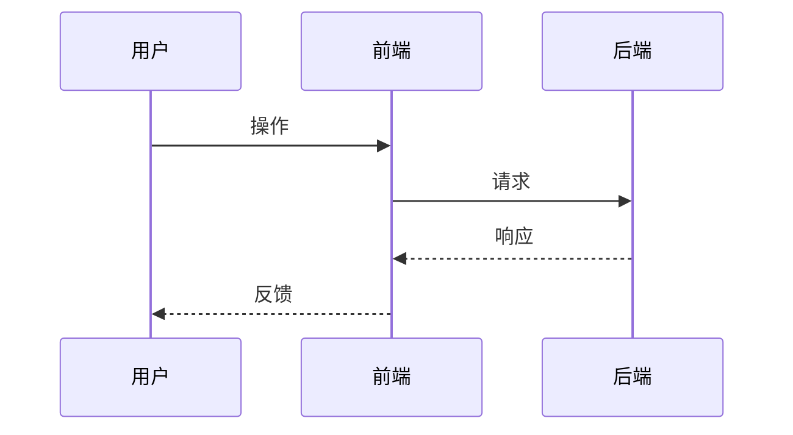

# <功能名称> — 状态机

> 仅当页面/组件涉及多状态流转（保存中、锁定、多人协作、异步任务等）时才需要此文件，简单 CRUD 页面可省略。

## 状态机

```mermaid
stateDiagram-v2
    [*] --> Idle
    Idle --> Loading: 触发操作
    Loading --> Success: 成功
    Loading --> Error: 失败
    Error --> Idle: 重试
    Success --> [*]
```

## 时序图（涉及多方交互时补充）

```mermaid
sequenceDiagram
    participant U as 用户
    participant FE as 前端
    participant BE as 后端
    U->>FE: 操作
    FE->>BE: 请求
    BE-->>FE: 响应
    FE-->>U: 反馈
```
